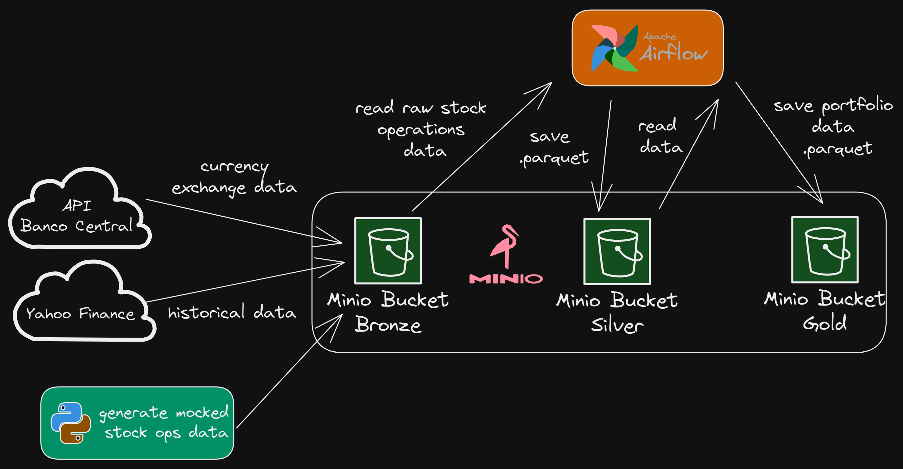

# Data processing for stock-portfolio project

You need to have installed docker and docker compose in your machine.

This project requires Python 3.11

Processing flowchat



## Activate venv in Linux

```bash
source .venv/Scripts/activate
```

## Activate venv in windows

```powershell
./.venv/Scripts/Activate.ps1
```

## Install requirements

```bash
pip install -r requirements.txt
```

## Run.py

To start the application you need to run python.py to setup de environment.

```bash
python3 run.py
```

This will start airflow and minio.
The script will prompt you to update varibles.json with the minio_api_access_key and minio_api_access_secret_key that you should create accessing minio console.
When you finish it, press enter to continue the script.

After the script end, you should access airflow, go to admin > variables and import varibles.json.

## Build stock_portfolio_data module

```bash
cd src && \
python3 setup.py clean --all && \
python3 setup.py bdist_wheel && \
pip install --upgrade --force-reinstall --no-cache-dir dist/stock_portfolio_data-0.0.0-py3-none-any.whl
```

## Access container

``` bash
docker exec -it stock-portfolio-data-airflow-scheduler-1 bash
```

### Reload airflow dags

```bash
airflow dags reserialize
```

### Export variables

```bash
airflow variables export my_variables.json
```
